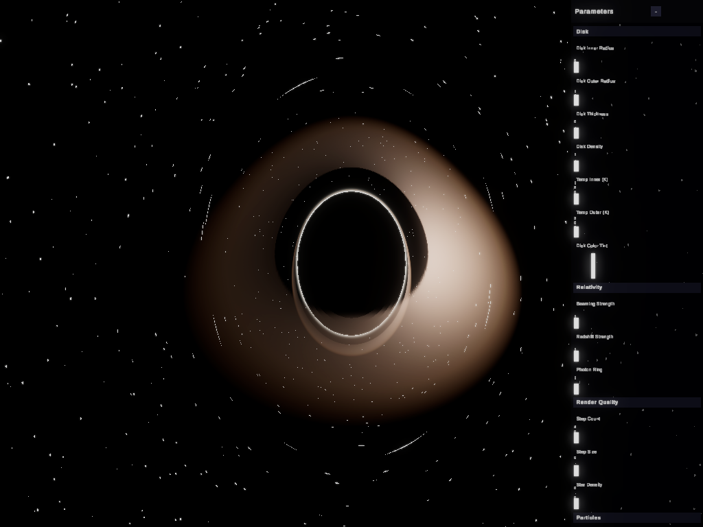

# claude-unity-project


Unity(URP) 기반 블랙홀 시뮬레이션. Paczyński–Wiita 유사-뉴턴 중력 + 슈바르츠실트 측지선 레이마칭 광학 + 볼륨메트릭 강착원반 + 상대론적 도플러 빔ing/중력 적색편이를 구현한다. Unity MCP 브릿지(`io.realvirtual.mcp`)를 통해 Claude 에이전트가 에디터/씬을 직접 조작할 수 있다.

## 개요

- **물리**: 호라이즌 근처에서 발산하는 PW 유사-뉴턴 중력(`GravityField`)으로 ISCO(=3·r_s) 붕괴와 포획을 재현. 광자는 별도의 슈바르츠실트 null 측지선 적분(`PhotonGeodesic`)으로 휘어진다.
- **광학**: `BlackHoleLens.shader`가 카메라 레이마다 측지선을 적분해 별 배경 굴절, 포톤 링, 이벤트 호라이즌 그림자, 볼륨메트릭 강착원반을 한 풀스크린 패스에서 그린다(`BlackHoleLensFeature`, URP RenderGraph).
- **상대론적 셰이딩**: 강착원반에 도플러 빔ing 비대칭 + 중력 적색편이를 적용(`Relativity`, 셰이더 미러).
- **입력**: 좌클릭 드래그로 투사체 던지기, 우클릭 드래그/스크롤로 카메라 오르빗/줌(`SimController`).
- **테스트**: 모든 물리 순수함수(`GravityField`, `Relativity`, `PhotonGeodesic`, `BlackBodyColor` 등)는 EditMode 테스트로 검증(`Assets/BlackHoleSim/Tests/Editor`).

## 코드 구성

```
Assets/BlackHoleSim/
├── Runtime/
│   ├── BlackHole.cs              # 중력원: G, mass, softening, r_s
│   ├── GravityField.cs           # PW 유사뉴턴 가속도/궤도속도 (순수함수)
│   ├── GravityIntegrator.cs      # Velocity Verlet 적분기 (입자/투사체 공용)
│   ├── PhotonGeodesic.cs         # 슈바르츠실트 null 측지선 적분 (셰이더 미러)
│   ├── Relativity.cs             # 도플러/적색편이/빔ing 순수함수
│   ├── BlackBodyColor.cs         # 온도(K) → RGB (Tanner Helland 근사)
│   ├── BlackHoleLensController.cs # 전역 셰이더 프로퍼티 push
│   ├── BlackHoleLensFeature.cs   # URP RendererFeature, 풀스크린 레이마칭 패스
│   ├── ParticleField.cs          # CPU 강착원반 입자 (시각 보조, 기본 비활성)
│   ├── ThrowableBody.cs          # 던지기 투사체 + 트레일
│   └── SimController.cs          # 입력: 던지기, 카메라 오르빗/줌
├── Shaders/BlackHoleLens.shader  # 레이마칭 본체 (측지선/디스크/별/톤매핑)
├── Editor/                       # 에디터 유틸리티
└── Tests/Editor/                 # EditMode 순수함수 테스트
Packages/io.realvirtual.mcp/      # Unity MCP 브릿지 (에이전트 제어)
```

## 파라미터 설정

모든 거리 스케일은 **r_s(EventHorizonRadius) 배수**로 통일되어 있다. ISCO(최내각 안정 궤도) = 3·r_s.

### `BlackHole` — 중력원

| 필드 | 기본값 | 설명 |
|---|---|---|
| `gravitationalConstant` (G) | 1 | 중력 상수, μ=G·mass 계산에 사용 |
| `mass` | 4000 | 블랙홀 질량 |
| `softening` | 0.5 | 광학 렌즈 셰이더 미러용 보존값 (PW 중력 자체는 사용 안 함) |
| `eventHorizonRadius` (r_s) | 2 | 슈바르츠실트 반경. 모든 거리 스케일의 기준 단위 |

### `GravityField` (정적, 코드 상수)

| 상수 | 값 | 설명 |
|---|---|---|
| `MinGapFraction` | 0.25 | `(r − r_s)`를 `r_s × 0.25`까지만 좁혀 호라이즌 근처에서 힘을 유한하게 유지 |

### `BlackHoleLensController` — 셰이더 전역 파라미터 (r_s 배수)

| 필드 | 기본값 | 설명 |
|---|---|---|
| `diskInnerRadius` | 6 (=3·r_s, ISCO) | 강착원반 내경 |
| `diskOuterRadius` | 22 | 강착원반 외경 |
| `diskThickness` | 0.5 | 원반 두께 |
| `diskDensity` | 1.2 | 원반 밀도(광학 깊이 스케일) |
| `diskTempInnerKelvin` | 18000 | 원반 내측 온도(K) — `BlackBodyColor` 입력 |
| `diskTempOuterKelvin` | 3000 | 원반 외측 온도(K) |
| `diskColorTint` | (1, 0.78, 0.55) 옅은 주황 | 원반 색조 틴트 — 흑체색에 곱해짐 |
| `beamingStrength` (0~1) | 1 | 도플러 빔ing 강도 |
| `redshiftStrength` (0~1) | 1 | 중력 적색편이 강도 |
| `photonRing` (0~4) | 1.5 | 포톤 링 강조 계수 |
| `stepCount` (64~1200) | 400 | 레이마칭 스텝 수 — 품질/성능 트레이드오프 |
| `stepSize` | 0.25 | 레이마칭 스텝 크기 |
| `starDensity` | 0.0025 | 절차적 별 배경 밀도 |

### `ParticleField` — CPU 강착원반 입자 (기본 비활성, 시각 보조용)

| 필드 | 기본값 | 설명 |
|---|---|---|
| `count` | 1500 | 입자 수 |
| `innerRadius` | 5 | 초기 분포 내경 |
| `outerRadius` | 14 | 초기 분포 외경 |
| `diskThickness` | 0.4 | 분포 두께 |
| `speedJitter` (0~0.5) | 0.12 | 궤도속도 랜덤 편차 |
| `maxRadius` | 45 | 이 거리를 넘으면 외부 공급 강착으로 재투입 |
| `infallSpeedFactor` (0.3~0.95) | 0.65 | 재투입 입자의 아임계 낙하 속도 비율 |
| `particleSize` | 0.18 | 렌더 크기 |

호라이즌에 포획되거나 `maxRadius`를 넘은 입자는 사라지지 않고 바깥 먼 거리에서 아임계 속도로 재투입된다(슬롯 재사용, 신규 할당 없음).

### `ThrowableBody` / `SimController` — 투사체 & 카메라

| 필드 | 기본값 | 설명 |
|---|---|---|
| `spawnDistance` | 24 | 카메라 기준 던지기 시작 거리 |
| `throwSpeedScale` | 0.05 | 드래그 거리 → 던지기 속도 변환 비율 |
| `bodyMaxRadius` | 80 | 투사체 생존 최대 거리 (초과/포획 시 파괴) |
| `orbitSpeed` | 0.2 | 우클릭 드래그 카메라 오르빗 감도 |
| `zoomSpeed` | 2 | 스크롤 줌 속도 |

### `Relativity` (정적 순수함수)

- `OrbitalSpeed(r, rs)`: 슈바르츠실트 국소 궤도속도, c=1 단위로 0.999 클램프
- `DopplerFactor(beta, cosAngle)`: δ = 1/(γ(1−β·cosθ))
- `GravitationalRedshift(r, rs)`: √(1 − r_s/r)
- `BeamingIntensity(dopplerFactor)`: δ⁴ (강도 스케일링)

## 입력

- **좌클릭 드래그 → 릴리즈**: 투사체 던지기 (드래그 벡터 = 던지는 방향/속도)
- **우클릭 드래그**: 카메라를 블랙홀 중심으로 오르빗
- **스크롤**: 줌 인/아웃

## 테스트

`Assets/BlackHoleSim/Tests/Editor`에 EditMode 테스트 존재. Unity Test Runner(Window > General > Test Runner)에서 EditMode 탭으로 실행, 또는 MCP 에디터 도구로 실행.

## 런타임 UI 패널



플레이 모드에서 화면 우측에 표시되는 파라미터 패널. `Tab` 키 또는 헤더의 `-` 버튼으로 패널 전체를 접고 펼 수 있다.

- **Disk**: 강착원반 내/외경, 두께, 밀도, 내·외측 온도(K), 색조 틴트(RGB)
- **Relativity**: 빔잉(Beaming) 강도, 중력 적색편이 강도, 광자구 두께
- **Render Quality**: 레이마칭 스텝 수/크기, 배경 별 밀도
- **Particles**: 입자 강착원반 토글 및 개수/반경/두께/지터/낙하속도 등
- **Danger Zone** (붉은 강조): G(중력상수), 질량, 소프트닝, 사건의 지평선 반경 — 시뮬레이션이 깨질 수 있는 민감한 값

패널은 `Assets/BlackHoleSim/Editor/BlackHoleSimUIBuilder.cs`의 에디터 빌더 스크립트가 UGUI 계층(Canvas + ScrollRect + 5개 CollapsibleSection + 각 파라미터 행)을 코드로 생성하고, `ParamPanelView`의 모든 필드를 `SerializedObject`로 와이어링한다. Unity MCP 브리지는 RectTransform(anchor/pivot/sizeDelta)을 직접 조작할 수 없어, 이 빌더를 `editor_invoke_method`로 1회 호출해 씬에 반영하는 방식을 사용했다.

## MCP 연동

`Packages/io.realvirtual.mcp`가 Unity 에디터를 WebSocket 브릿지로 노출해 Claude가 씬 조회/수정, GameObject/Component/Transform 조작, 시뮬레이션 재생/일시정지, 스크린샷 등을 직접 수행할 수 있게 한다.
